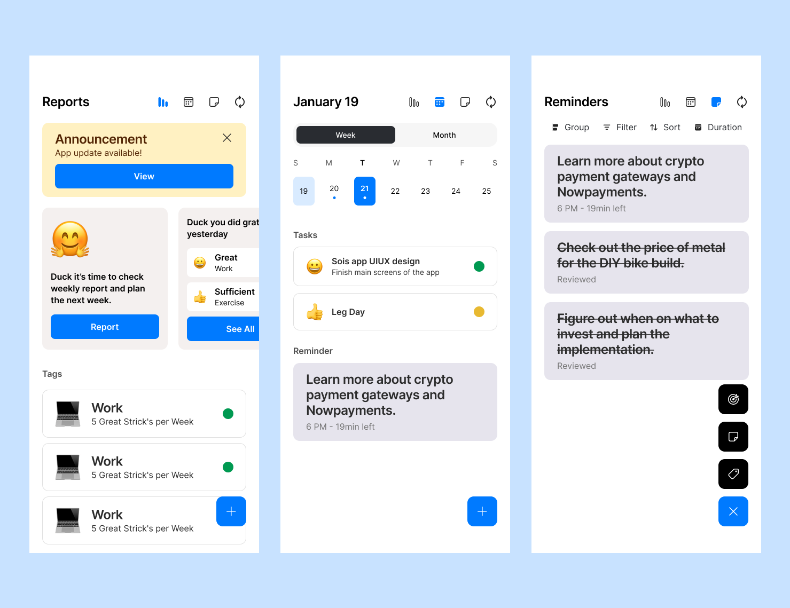

# **SOIS – Your Smart Reminder & Task Tracker** 📅✅  

**SOIS** is a sleek and intuitive **Flutter** app designed to keep you organized, productive, and on track. Whether it's daily tasks, project deadlines, or important reminders, TaskEase ensures you never miss a beat!  



## 🚀 **Features**  

✅ **Smart Task Management** – Create, organize, and prioritize tasks effortlessly.  
✅ **Custom Reminders & Notifications** – Set reminders with flexible scheduling.  
✅ **Recurring Tasks** – Automate daily, weekly, or custom repeat schedules.  
✅ **Beautiful UI & Dark Mode** – A modern, user-friendly interface with dark mode support.  
✅ **Progress Tracking** – Mark tasks as completed and monitor productivity trends.  
✅ **Cloud Sync & Backup** – Keep your tasks safe and accessible across devices.  

## 🎯 **Use Cases**  

- **Students** – Keep track of assignments, deadlines, and study plans.  
- **Professionals** – Manage work tasks, meetings, and personal goals.  
- **Freelancers** – Organize client work and daily routines.  
- **Anyone** – Stay productive and never forget important tasks!  

## 🛠 **Installation & Setup**  

### **Requirements**  
- Flutter SDK  
- Dart  

### **Installation**  

```bash
git clone https://github.com/DagmawiIsaiah/sois.git
cd sois
flutter pub get
```

### **Run the App**  

```bash
flutter run
```

---

Project under development.